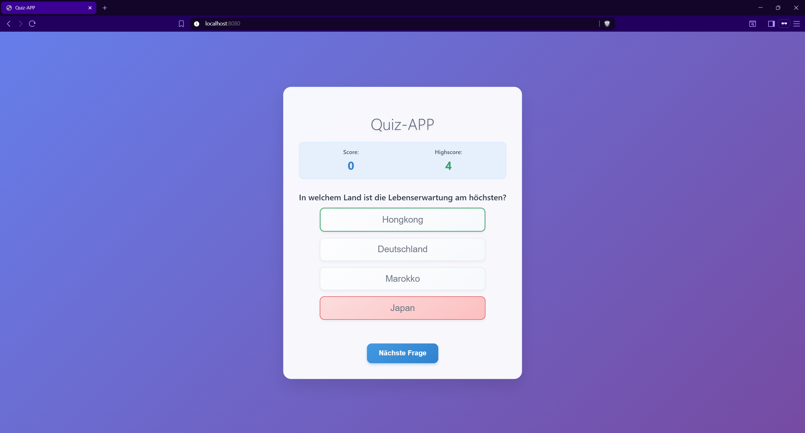
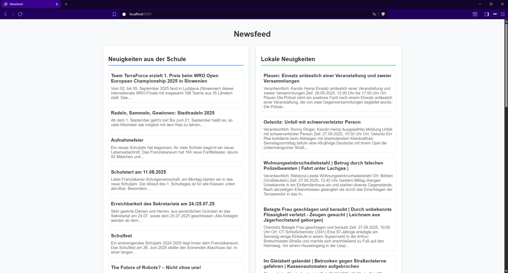

# Webapp Workshop
Einige kleine Beispiele für Webanwendugen, die im Rahmen eines Wochenend-Workshops von Schülern entwickelt werden könnten.

## Beispiele

### Quiz

Im Ordner [/quiz](./quiz) befindet sich eine simple Quiz-Anwendung, die sich aus einem Frontend und einem Backend zusammensetzt.



#### Mögliche Erweiterungsideen:

- Schwierigkeit der Fragen basierend auf Anzahl der richtigen Antworten generieren
- "Joker" hinzufügen
- falsche Antworten zu Fragen zufällig generieren (per LLM (z. B. chatGPT))
- Fragen in einer Datenbank speichern
- Highscore als Cookie im Browser speichern
- Nutzer-System bauen  
    - Login 
    - Highscore pro Nutzer
    - Scoreboard

### Newsfeed

Im Ordner [/newsfeed](./newsfeed/) befindet sich eine einfache Newsfeed-Anwendung. Diese sammelt aktuelle Nachrichten aus dem Web und stellt sie dar. Aktuell werden lokale Nachrichten dargestellt sowie Neuigkeiten aus der Schule.



#### Mögliche Erweiterungsideen:

- caching: 
    - nicht bei jeder Anfrage neues Scraping durchführen, sondern Ergbnisse zwischenspeichern, nach bestimmter Zeit ablaufen lassen
    - Scraping in weiteren Dienst auslagern, der automatisch von Zeit zu Zeit vom Backend angefragt wird, damit es zu keinen Zeitverzögerungen kommt
    - schönere Teaser-Texte anzeigen -> Links folgen -> Achtung: nicht zu viele Anfragen an den Server senden
- Filtern nach Schlüsselworten in den Neuigkeiten

### Messenger

Im Ordner [/messenger](./messenger/) befindet sich eine simple Messenger-Anwendung, die mit Websockets funktioniert.

...TBD...

### weitere Ideen für Anwendungen

- Einkaufsliste
- Geburtstagskalender
- simpler Messenger
- ...

## Werkzeuge

### venv (optional)

Um die für ein Projekt benötigten Python-Pakete zu installieren, kann eine virtuelle Umgebung (`venv`) verwendet werden. Dadurch werden die Pakete nicht lokal installiert. Dies kann insbesondere dann hilfreich sein, wenn für verschiedene Projekte das gleiche Paket in unterschiedlichen Versionen notwendig ist. 

```bash
pip install virtualenv
cd {project}
python3 -m venv env
source env/bin/activate #linux, mac; windows: 'venv\Scripts\activate.bat' oder 'venv\Scripts\Activate.ps1'
pip install -r requirements.txt
```

Hinweis: Für jede neue Terminal-Session muss die Umgebung neu aktiviert werden (`source env/bin/activate`).

### Frontend

#### kein Framework/Library: HTML, CSS, JS

TBA

#### Python NiceGUI

NiceGUI => Python Package

Ausführen:
```bash
python3 main.py
```

weitere Detauls: siehe [Dokumentation](https://nicegui.io/documentation)


### Backend

#### FastAPI
FastAPI ist eine Python-Bibliothek, die für die komfortable Erstellung eines Backends beziehungsweise einer API bentuzt werden kann.

Ausführen eines Dev-Servers:
```bash
fastapi dev main.py
```

weitere Details: siehe [FastAPI-Dokumentation](https://fastapi.tiangolo.com/)

#### Beautiful Soup
Beautiful Soup ist eine Python-Bibliothek, die das Web-Scraping vereinfacht. Sie bietet die Möglichkeit, komfortabel Informationen aus HTML-Dokumenten zu parsen. 

[Dokumenation](https://www.crummy.com/software/BeautifulSoup/bs4/doc/)

### Testen - pytest

Mittels Testen wird sichergestellt, dass die Software einer definierter Funktionalität entspricht. Für die Backends der Newsfeed-App und der Quiz-App sind bereits Tests geschrieben, die die grundlegende Funktionalität der Anwendungen abdecken. Die Tests für die Newsfeed-App befinden sich in [/newsfeed/backend/test_main.py](/newsfeed/backend/test_main.py) und für die Quiz-App befinden sich die Tests in [/quiz/backend/test_main.py](/quiz/backend/test_main.py).

FastAPI stellt bereits eine Möglichkeit zur Verfügung, wie APIs, die mit FastAPI geschrieben sind, komfortabel getestet werden können. [FastAPI Dokumentation zum Testing](https://fastapi.tiangolo.com/tutorial/testing/)

Ausgeführt werden können die Tests, indem im jeweiligen Ordner der Anwendung `pytest` in der Kommandozeile ausgeführt wird. pytest findet die Tests dann automatisch und führt sie aus.
